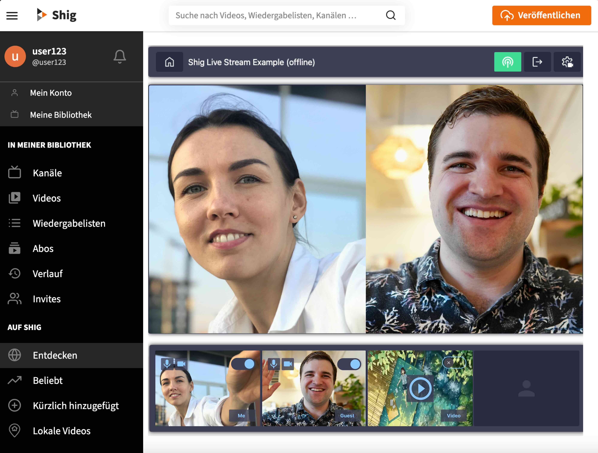

# PeerTube Shig Lobby

This [PeerTube](https://joinpeertube.org/) plugin is meant to provide interactive streams for PeerTube.

It consists of a Shig lobby that can connect to a Shig instance (https://github.com/shigde/sfu) , which in turn can
distribute livestreams within the Fediverse.

## Features

| Feature                   | Description                                                                               | Develop State | Release |
|---------------------------|-------------------------------------------------------------------------------------------|---------------|---------|
| **Multi Guest Streaming** |                                                                                           |               |         |
| Instance wide             | PeerTube users of the instance can be invited to the lobby and participate in the stream. | finish        |         |
| Fediverse wide            | Any PeerTube user can be invited to the lobby.                                            | testing       |         |
| Ask for invitation        | PeerTube users can request to participate.                                                | develop       |         |
| **Live Text Chat**        |                                                                                           |               |         |
| Logget in viewer          | A live text chat for logged-in users can be provided alongside the stream                 | planned       |         |
| All viewer                | A live text chat for all viewer can be provided alongside the stream                      | planned       |         |
| **Video/Audio Track**     |                                                                                           | develop       |         |
| playable                  | Upload tracks that will be playable in the lobby.                                         | develop       |         |
| stream tracks endless     | Tracks will be runnable in an endless loop.                                               | develop       |         |
| **Lobby**                 |                                                                                           |               |         |
| Worker                    | Render the stream in a worker process                                                     | planned       |         |
| Movable Tiles             | The position of the video tile should be adjustable                                       | planned       |         |
| Overlays                  | Add name overlay to the video tile.                                                       | planned       |         |
| Custom Overlays           | Users can create their own stream overlays.                                               | planned       |         |

**Develop States**: planed | develop | testing | finish

## Developing

### PeerTube Instance

To develop on the plugin, it is recommended to set up a local PeerTube instance.
Please follow the instructions: [docker/README.md](./docker/README.md).

The instructions also include information on local deployment.

### Shig-JS-SDK

The plugin itself uses the [Shig-JS-SDK](https://github.com/shigde/shig-js-sdk). The SDK is placed
in `./public/javascript/shig-lobby.js`

## Funded by

&nbsp; &nbsp; &nbsp; &nbsp; &nbsp; &nbsp; &nbsp; &nbsp; &nbsp; &nbsp; &nbsp; &nbsp; 

