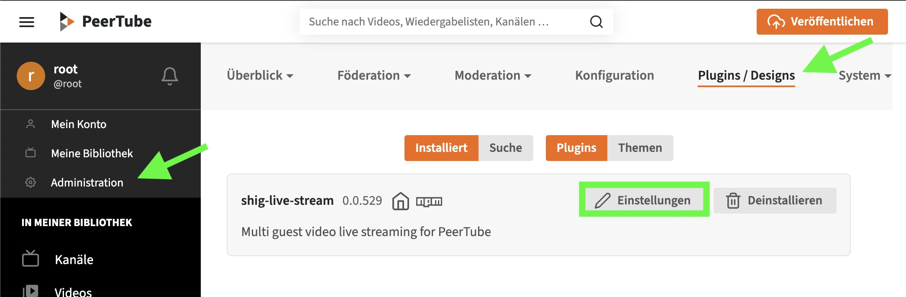
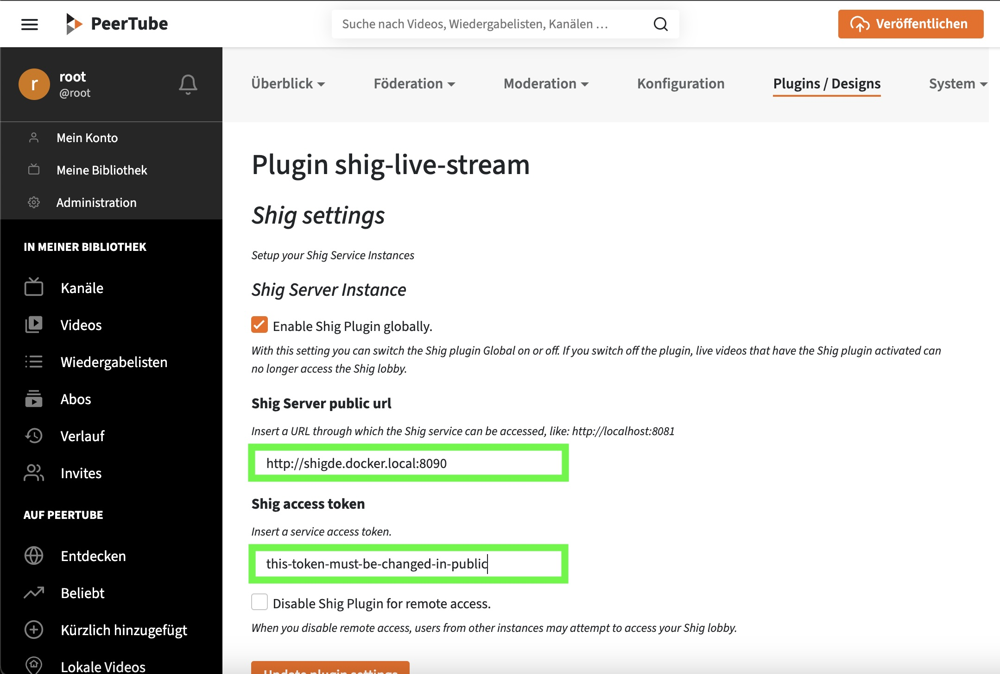
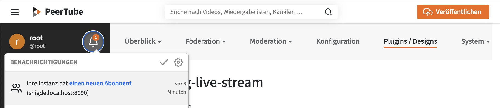

# Docker dev environment

## Run

```
docker-compose up -d
```

You can open in a webbrowser:

**PeerTube**: http://peertube.localhost:9001/

**Shig**: http://shigde.localhost:8090/federation/accounts/shig

### PeerTube Root login

```
user: root
pass: test
```

## Install Plugin

```
./plugin-install.sh
```

## Register Shig

To register the 'shig' instance, you need to include the service in the plugin settings. 
You can locate these settings under: `Administration/Plugin/Design`



Afterward, you can input the URL `http://shigde.localhost:8090` and secret key `this-token-must-be-changed-in-public` for the 'shig' instance. 



Shig will automatically follow this PeerTube instance.




# PeerTube Remote Instance
Sometimes you need a second instance, for example when working on ActivityPub remote videos. 
That's why I placed a second Docker configuration in the `remote` folder.
